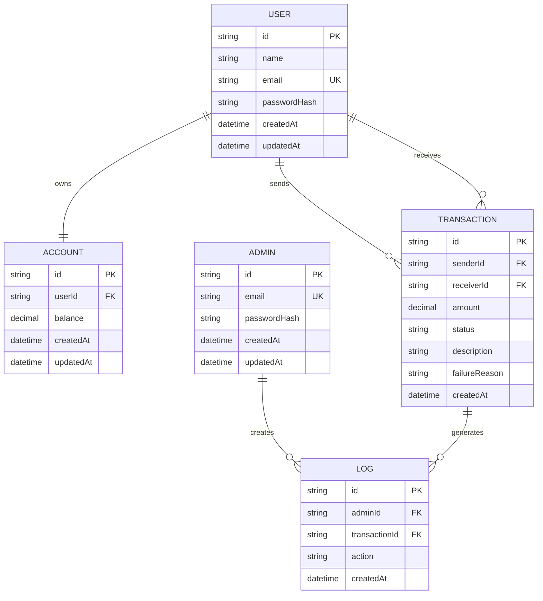

# PulsePay DBMS Enhancement Report

This document extends the existing PulsePay project with DBMS-focused material that can be used directly in a course report or viva. The implementation remains consistent with the current React + Express + Prisma architecture.

## 1. ER Diagram and Schema Design

### ER Model



### Relational Schema

Current Prisma implementation uses `Wallet` as the account table. For academic presentation, the conceptual schema can be written as follows:

- `User(id PK, name, email UNIQUE, passwordHash, createdAt, updatedAt)`
- `Account(id PK, userId FK -> User.id UNIQUE, balance, createdAt, updatedAt)`
- `Transaction(id PK, senderId FK -> User.id, receiverId FK -> User.id, amount, status, description, failureReason, createdAt)`
- `Admin(id PK, email UNIQUE, passwordHash, createdAt, updatedAt)`
- `Log(id PK, adminId FK -> Admin.id, transactionId FK -> Transaction.id, action, createdAt)`

### How this maps to the existing Prisma schema

- `User` matches the current `User` model.
- `Account` maps to the current `Wallet` model.
- `Transaction` matches the current `Transaction` model.
- `Admin` matches the current `Admin` model.
- `Log` is an optional audit table that can be added for stronger DBMS marks.

### 3NF Justification

The design is in Third Normal Form because:

1. Each table stores one entity type.
2. Non-key attributes depend only on the primary key.
3. There are no repeating groups or multivalued fields.
4. Transitive dependencies are avoided. For example, account balance is not stored inside the user table, and transaction sender/receiver details are not duplicated in every transaction row.

This reduces update anomalies, insertion anomalies, and deletion anomalies.

## 2. SQL Query Showcase

The following queries are suitable for a DBMS report because they represent real banking operations.

### 2.1 SELECT with conditions

```sql
SELECT id, senderId, receiverId, amount, status, createdAt
FROM "Transaction"
WHERE status = 'SUCCESS' AND amount >= 1000
ORDER BY createdAt DESC;
```

### 2.2 JOIN query

```sql
SELECT
  t.id,
  u1.email AS sender_email,
  u2.email AS receiver_email,
  t.amount,
  t.status,
  t.createdAt
FROM "Transaction" t
JOIN "User" u1 ON t.senderId = u1.id
JOIN "User" u2 ON t.receiverId = u2.id
ORDER BY t.createdAt DESC;
```

### 2.3 GROUP BY and aggregation

```sql
SELECT
  status,
  COUNT(*) AS txn_count,
  SUM(amount) AS total_amount,
  AVG(amount) AS avg_amount
FROM "Transaction"
GROUP BY status;
```

### 2.4 Nested query

```sql
SELECT email, name
FROM "User"
WHERE id IN (
  SELECT senderId
  FROM "Transaction"
  GROUP BY senderId
  HAVING SUM(amount) > 5000
);
```

### 2.5 High-value transfer summary

```sql
SELECT
  DATE(createdAt) AS txn_day,
  COUNT(*) AS total_txns,
  SUM(amount) AS daily_volume
FROM "Transaction"
WHERE amount >= 1000
GROUP BY DATE(createdAt)
ORDER BY txn_day DESC;
```

## 3. XML Data Integration

### Backend feature added

The project now exposes an admin XML export endpoint:

```http
GET /api/admin/transactions/export/xml
```

This endpoint returns the transaction list as XML. It can be used for report generation, external systems, or interchange with legacy tools.

### Sample XML structure

```xml
<?xml version="1.0" encoding="UTF-8"?>
<transactions>
  <transaction>
    <id>txn_001</id>
    <senderEmail>judson@example.com</senderEmail>
    <receiverEmail>ameera@example.com</receiverEmail>
    <amount>250.00</amount>
    <status>SUCCESS</status>
    <createdAt>2026-04-15T10:30:00.000Z</createdAt>
    <description>Monthly transfer</description>
    <failureReason></failureReason>
  </transaction>
</transactions>
```

### XPath examples

Filter high-value transactions:

```xpath
/transactions/transaction[amount > 1000]
```

Retrieve failed transactions:

```xpath
/transactions/transaction[status = 'FAILED']
```

### XQuery examples

High-value transactions:

```xquery
for $t in doc("transactions.xml")/transactions/transaction
where xs:decimal($t/amount) > 1000
return $t
```

Failed transactions:

```xquery
for $t in doc("transactions.xml")/transactions/transaction
where $t/status = 'FAILED'
return $t
```

### Integration explanation

The backend builds XML from Prisma transaction results and sends it with `Content-Type: application/xml`. This keeps the core system unchanged while adding a DBMS-relevant export format.

## 4. OQL Mapping

Prisma uses object-style relations, so it maps naturally to OQL concepts.

### Mapping

- `User` corresponds to an object class.
- `Wallet`/`Account` is a related object owned by a user.
- `Transaction` is an object with references to sender and receiver objects.
- `Admin` is another object class.
- `Log` can be treated as an audit object class.

### OQL-style queries

High-value transactions:

```oql
SELECT t
FROM Transaction t
WHERE t.amount > 1000 AND t.status = "SUCCESS";
```

Transactions sent by a particular user:

```oql
SELECT t
FROM Transaction t
WHERE t.sender.email = "judson@example.com";
```

Users with balances below a threshold:

```oql
SELECT u
FROM User u
WHERE u.wallet.balance < 500;
```

### Viva explanation

OQL is useful conceptually because the application already works with objects and relations. Prisma relations behave like object references, so the schema can be explained using object-oriented database ideas even though PostgreSQL is the physical store.

## 5. Deadlock Scenario Documentation

### Example

- User A transfers money to User B.
- At the same time, User B transfers money to User A.

### How deadlock can happen

1. Transaction 1 locks A's wallet first.
2. Transaction 2 locks B's wallet first.
3. Transaction 1 waits for B's wallet.
4. Transaction 2 waits for A's wallet.
5. Both transactions wait forever unless the database detects and breaks the cycle.

### How the project handles it

- Transfers are wrapped in a serializable transaction.
- Wallets are fetched in a fixed order in the service layer.
- The retry helper retries failed transactions.
- If a transaction fails, it is rolled back and the failed transfer is recorded with status `FAILED`.

### Viva explanation

Deadlock occurs when two transactions hold locks needed by each other. The project avoids this by using transaction control, lock ordering, rollback, and retry handling.

## 6. Indexing and Optimization

### Suggested indexes

```sql
CREATE INDEX idx_transaction_sender_id ON "Transaction" (senderId);
CREATE INDEX idx_transaction_receiver_id ON "Transaction" (receiverId);
CREATE INDEX idx_transaction_created_at ON "Transaction" (createdAt);
CREATE INDEX idx_transaction_status ON "Transaction" (status);
CREATE INDEX idx_wallet_user_id ON "Wallet" (userId);
```

### Why indexes help

- Faster transaction history lookup for a user.
- Faster admin filtering on sender/receiver.
- Faster date-based analytics.
- Faster failure/success summaries.

### Viva explanation

Indexes improve read performance by reducing full table scans. In PulsePay, they help because transaction history and admin dashboards frequently query by user, date, and status.

## 7. Triggers and Stored Procedures

These are PostgreSQL-compatible and can be included in the report as advanced DBMS features.

### 7.1 Transaction logging trigger

```sql
CREATE TABLE IF NOT EXISTS transaction_log (
  id SERIAL PRIMARY KEY,
  transaction_id TEXT NOT NULL,
  action TEXT NOT NULL,
  created_at TIMESTAMP NOT NULL DEFAULT NOW()
);

CREATE OR REPLACE FUNCTION log_transaction_insert()
RETURNS TRIGGER AS $$
BEGIN
  INSERT INTO transaction_log(transaction_id, action)
  VALUES (NEW.id, 'TRANSACTION_CREATED');
  RETURN NEW;
END;
$$ LANGUAGE plpgsql;

CREATE TRIGGER trg_log_transaction_insert
AFTER INSERT ON "Transaction"
FOR EACH ROW
EXECUTE FUNCTION log_transaction_insert();
```

### 7.2 Safe transfer stored procedure

```sql
CREATE OR REPLACE PROCEDURE transfer_money(
  IN p_sender_id TEXT,
  IN p_receiver_id TEXT,
  IN p_amount NUMERIC,
  IN p_description TEXT
)
LANGUAGE plpgsql
AS $$
DECLARE
  sender_balance NUMERIC;
BEGIN
  IF p_sender_id = p_receiver_id THEN
    RAISE EXCEPTION 'Sender and receiver cannot be the same';
  END IF;

  SELECT balance INTO sender_balance
  FROM "Wallet"
  WHERE "userId" = p_sender_id
  FOR UPDATE;

  IF sender_balance < p_amount THEN
    RAISE EXCEPTION 'Insufficient balance';
  END IF;

  UPDATE "Wallet"
  SET balance = balance - p_amount
  WHERE "userId" = p_sender_id;

  UPDATE "Wallet"
  SET balance = balance + p_amount
  WHERE "userId" = p_receiver_id;

  INSERT INTO "Transaction" (id, "senderId", "receiverId", amount, status, description, "createdAt")
  VALUES (gen_random_uuid()::text, p_sender_id, p_receiver_id, p_amount, 'SUCCESS', p_description, NOW());
END;
$$;
```

### Viva explanation

Triggers automate actions after a database event, such as logging a new transaction. Stored procedures encapsulate complex business logic inside the database, which is useful in banking systems.

## 8. Documentation and Viva Explanation

### Short viva answers

- **Why is the design normalized?** Because each table stores one fact type and prevents redundancy.
- **Why use transactions?** To make sure money transfers are atomic and consistent.
- **Why use indexes?** To speed up frequent queries like history, analytics, and summaries.
- **Why export XML?** For structured interchange and reporting.
- **Why mention OQL?** To explain how Prisma relations behave like object references.
- **Why handle deadlocks?** Banking operations must remain reliable under concurrent access.
- **Why use triggers/procedures?** To push repeatable database logic closer to the data.

## 9. Implementation Notes

### What has already been extended in the project

- XML export endpoint for admin transactions.
- Polished frontend with compact top navigation.
- Forgot password workflow.
- SQLite fallback for local development, while keeping Prisma structure compatible with PostgreSQL concepts for the report.

### Suggested report line

"PulsePay combines a Prisma-based application layer with relational database principles such as normalization, transaction management, indexing, concurrency control, and database-level automation to demonstrate a complete DBMS-oriented banking system."
